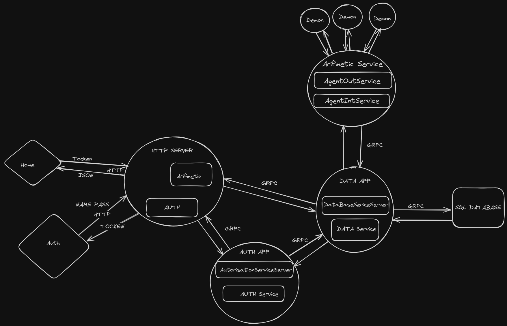

# Arifmetic_Server

Привет тебе путник!

Ну а если серьезно.

### Запуск сервера

#### 1ый способ
Если нет докера или утилиты make выполни команду:

go run services/cmd/server/main.go --config=config_file/configuration.json 

#### 2ой способ
Если есть утилита make выполни команду:

make running

#### 3ий способ
Сборка и запуск сервера в  Docker:

###### 1.Из директории проекта запусти команду:
docker build . -t arifmetic:v2
дождись выполнения

###### 2. Запусти команду:
docker run -p 8080:8080 arifmetic:v2

### Тестирование сервера и его работы:

Открой в браузере http://localhost:8080/arifmetic/auth

Откроется окно Авторизации. Есть две кнопки:

1. Register добавляет пользователя в базу данных.

2. Login проверяет пользователя в базе данных. И выдает токен доступа и перенаправляет на главную страницу. 

Главная страница находтся по адресу http://localhost:8080/arifmetic/home

Есть окно ввода выражений и их отправки на сервер.

Так же есть кнопка для получение ответа от сервера с выражениями.

Так же можно потестировать с помощью Postman.

Отправка данных для регистрации и входа по адресу: 
http://localhost:8080/arifmetic/auth/v1

Отправка вырражений и получения ответа по адресу: 
http://localhost:8080/arifmetic

#### Техническая реализация
Итак, а теперь давай объясню как весь мой бредовый код работает.

В директории есть файл Sheme. Там немного визуализированно то как сейчас это работает.

В общем виде все состоит из трех приложений:

1. Auth занимается сохранением данных пользователей и генерации токенов.

2. Arifmetic занимается вычилением выражений.

3. Data пожалуй главное приложение. Здесь хранятся данные пользователей и выражения. Все остальное обращается к этому сервису.

Так же работает HTTP сервер который принимает запросы от пользователей. И запрашивает нужные данныые из других сервисов и отправляет ответ пользователю.

Аутентификация происходит при парсинге токена. У токена есть срок действия. Если срок действия истек происходит перенаправление на страницу авторизации. 
Все пароли сохраняются в хешированом виде.

В общих чертах как то так, возможно что то упустил.

Что насчет примеров. Можно слать любые в том чиле и со скобками ответ будет правильным. Если в выражении есть остаток от деления ответом будет целая часть.
##### UPD. При делении на 0 программа валится.
#### Примеры выражений:
1 + 2;  
4 * 3; 
6 - (8 + 2); 
89 / 8; 
678 + 877; 
8877 / 88; 
7 * 65; 
0 - 877 * 76; 
1 + 234 * (88766 - 888); 
76 - 8; 
45 + 866; 
7546 - 87777; 
788 / 88; 
766 / 5; 
90 - 888; 
890 / 7; 
788 * 777; 

Спасибо за внимание! 
Tg: @Nikolasff
